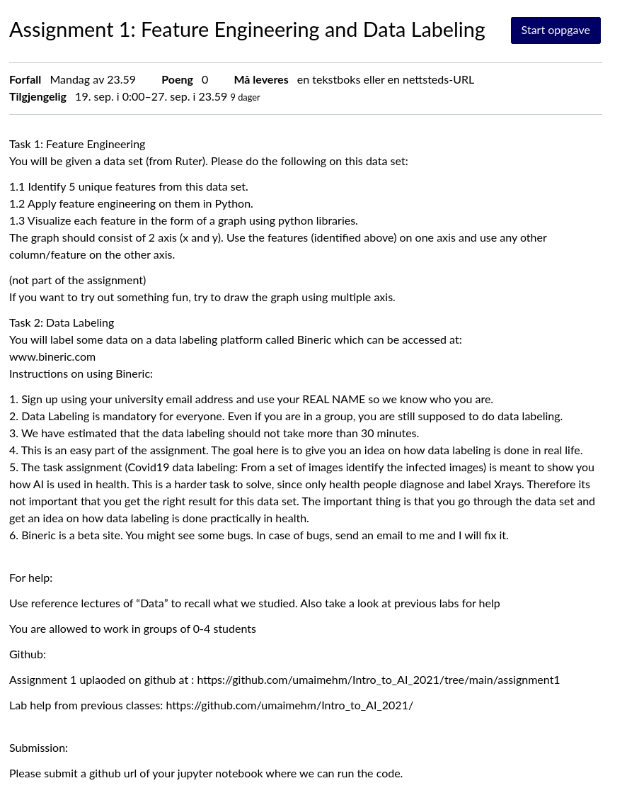
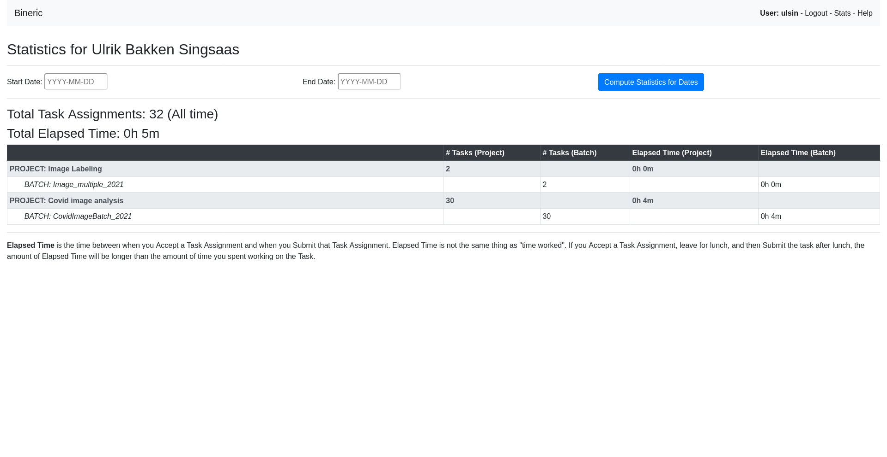

# Cool sources and documentation

[Assignment Link](https://oslomet.instructure.com/courses/21783/assignments/49829)

Ulrik Bineric Proof

[Lab Repo](https://github.com/umaimehm/Intro_to_AI_2021)

[Numpy Manual](https://numpy.org/doc/stable/)

[Pandas Documentation](https://pandas.pydata.org/docs/reference/index.html#api)  
[Pandas Tutorial](https://github.com/TirendazAcademy/PANDAS-TUTORIAL)  
[Pandas Video Tutorial](https://www.youtube.com/watch?v=vmEHCJofslg)

[Seaborn Documentation](https://seaborn.pydata.org/api.html)

## NB!!!!

Remember to do the second task individually should take like 30 mins

